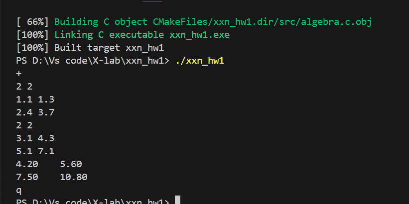
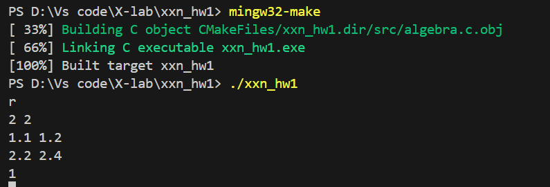

# 基本思路 
根据线性代数矩阵的加、减、乘、数乘、求转置、求行列式、求逆、求秩、求迹的运算原理来编写代码，同时借助AI进行优化。

在使用cmake进行运行的时候，出现了C语言不支持C99/C11标准的问题，在网上查询了许多资料，修改了语言标准，但输出显示根据文件格式，自动转换成C17旧标准。最后采取将变量的定义放到for循环外面的做法来解决。

运行cmake时，add_executable的文件位置的设置出现了较大问题，后来询问学长后才修正，并最终实现了代码的运行。
# 运行结果

矩阵的加法运行结果

矩阵求秩运行结果
